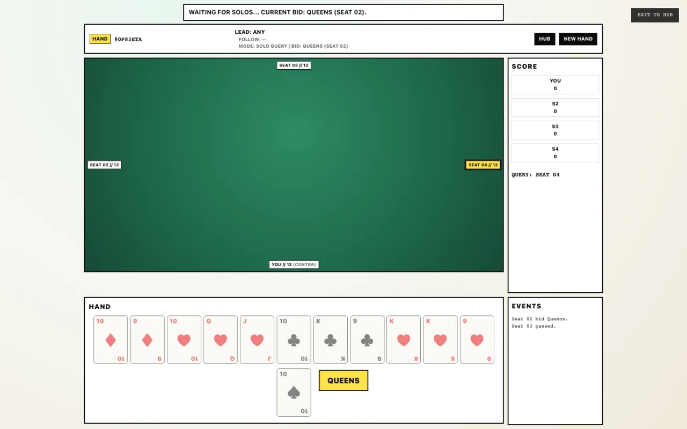

# Täglich Doko

A configurable Doppelkopf game for the browser, currently shipping the extracted legacy engine and two heuristic opponents while a greenfield engine and agent generation are built.



## Status

This repository is an early public preview, not a rules-certified Doppelkopf implementation.

| Capability                         | Current status                                                     |
| ---------------------------------- | ------------------------------------------------------------------ |
| Browser game and three table views | Available                                                          |
| Heuristic V1 and V2 bots           | Available                                                          |
| Configurable legacy house rules    | Available, not yet certified as a complete combination matrix      |
| Legacy ONNX bots                   | Source retained for research; models are not shipped or selectable |
| Greenfield V3 engine               | Designed, not implemented                                          |
| Structured-Belief Policy Agent     | Designed, not implemented                                          |
| Belief-Search Agent                | Designed, not implemented                                          |

Classic, Oblivious, and Tournament are intended to become different UIs and initial settings over one shared engine. The current Tournament view still has its own legacy controller and automatically passes reservations; it must not be used as evidence of tournament-rule conformance.

## Run locally

Requirements: Node 24-26 and npm 11; Node 24 is recommended by `.nvmrc`.

```sh
npm ci
npm run dev
```

Open `http://localhost:4321/doppelkopf/`.

## Verify

```sh
npx playwright install chromium
npm run verify
```

`verify` checks formatting, TypeScript/Astro diagnostics, the production build, engine tests, and browser routes. Production dependencies are also expected to pass `npm audit --omit=dev --audit-level=high` before release.

## Agent direction

We will try exactly these two product model designs, excluding plumbing baselines and search lower bounds:

1. **Structured-Belief Policy Agent:** a rule-conditioned policy/value model with a set encoder for the hand, a GRU or small causal transformer for public events, and a constrained distribution over feasible hidden worlds.
2. **Belief-Search Agent:** the same learned core with observation-correct belief or observation-space planning, followed by distillation and a measured decision on whether live browser search is worth its latency.

The normative architecture is [Agent V3 Design](docs/plans/doppelkopf/AGENT-V3-DESIGN.md). The independently implementable work graph starts at [V3 Backlog](docs/plans/doppelkopf/BACKLOG.md).

## Repository boundaries

- [`mafn/doppelkopf`](https://github.com/mafn/doppelkopf) owns the browser application, canonical engine, rules, observation/action schemas, and browser inference runtime.
- [`mafn/doppelkopf-training`](https://github.com/mafn/doppelkopf-training) owns data generation, training, large evaluation, search experiments, export, and artifact verification.
- Hugging Face will own released model weights, model cards, manifests, and evaluation reports. No model repository is claimed until that release chain exists.

The browser repository remains one npm package. V3 uses explicit module boundaries within it; it does not introduce npm workspaces unless independently versioned packages become necessary.

## Current layout

- `src/lib/doppelkopf/`: legacy engine, heuristic bots, and retained experimental ML runtime
- `src/components/doppelkopf/`: current browser table views
- `docs/doppelkopf/rules.md`: legacy rules notes
- `docs/plans/doppelkopf/`: V3 design and implementation backlog
- `tests/`: engine, feature, replay, and browser checks

The existing engine is useful executable evidence, but it is not the V3 contract. In particular, the current replay format is not a certified canonical replay and the three table views do not yet share one controller.

## Contributing

Read [CONTRIBUTING.md](CONTRIBUTING.md) before changing rules, engine behavior, schemas, or generated artifacts. Security reports follow [SECURITY.md](SECURITY.md).

## License

MIT. See [LICENSE](LICENSE) and [THIRD_PARTY_NOTICES.md](THIRD_PARTY_NOTICES.md).
