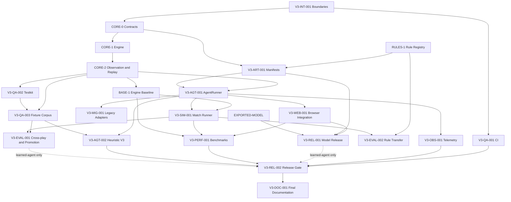

# Doppelkopf V3 Integration, Runtime, and Release Backlog

Status: implementation backlog  
Scope: repository integration, test infrastructure, agent runtime, browser adoption, evaluation, artifacts, release engineering, and migration

## How to use this backlog

Each task is sized for one medium-effort implementation agent and has a deliberately narrow ownership boundary. Tasks may run concurrently once their listed dependencies are complete. Generated data, model training, the rules engine implementation, and learned-model architecture are owned by other workstreams; this backlog integrates their outputs without reimplementing them.

The following aliases map directly to concrete tasks in the other workstreams:

- `CORE-0 = ENG3-001`: V3 contracts are frozen.
- `CORE-1 = ENG3-012`: the integrated hand engine and complete legal actions exist.
- `RULES-1 = ENG3-013`: curated rule packs and rule-effect metadata exist.
- `CORE-2 = ENG3-014`: observation projection, canonical replay, and certification exist.
- `BASE-1 = ENG3-015`: the certified legal-random baseline exists.
- `EXPORTED-MODEL = DEPLOY-001`: at least one V3 model and manifest have been exported.

All tasks treat `docs/plans/doppelkopf/AGENT-V3-DESIGN.md` as normative. V1 types, feature vectors, rollouts, and checkpoints are legacy inputs and must not silently become V3 contracts.

## Backlog

### V3-INT-001: Establish V3 repository and module boundaries

**Dependencies:** None.

**Context and scope**

V3 spans the browser repository, the training repository, and model artifacts published separately. Establish ownership and module boundaries before parallel implementation begins so agents do not invent incompatible paths or import Node-only training code into the application.

Keep the browser repository as one npm package. Establish browser-safe modules under:

- `src/lib/doppelkopf/v3/engine`
- `src/lib/doppelkopf/v3/agents`
- `src/lib/doppelkopf/v3/testkit`

Keep data generation, learners, large evaluation jobs, and Python code in `doppelkopf-training`. Consume the browser repository as a read-only Git submodule at `vendor/doppelkopf`, pinned to an exact commit; require `engine.lock.json` to match that gitlink, schema IDs, and rule hashes. Define concise ownership READMEs and root scripts for V3 type checking, unit tests, complete tests, and benchmarks. Keep generated reports, models, trajectories, and local benchmark results out of Git while retaining schemas, small fixtures, configurations, and selected golden reports.

**Definition of done**

- Every browser module resolves from Node and the Astro application without a workspace layer.
- Training consumes the pinned submodule revision and rejects an engine-lock mismatch.
- Browser-facing imports cannot transitively load Node-only modules.
- A clean `npm ci` can execute all newly declared root scripts.
- No V1 source is moved, deleted, or made a dependency of a V3 public contract.

**Testing plan**

- Type-only cross-module import test.
- Node ESM import smoke test for every public module entry point.
- Astro build smoke test importing a browser-safe V3 entry point.
- Negative test proving a Node-only evaluation entry point is not browser-exported.

---

### V3-QA-001: Add V3 continuous-integration gates

**Dependencies:** `V3-INT-001`.

**Context and scope**

Create a tracked GitHub Actions workflow that makes the V3 contracts enforceable without requiring a GPU. Separate fast pull-request checks from extended conformance and benchmark jobs.

The fast gate covers formatting, V3 type checks, V3 unit tests, the Astro build, and targeted browser parity tests. Extended jobs may run the complete replay/conformance corpus and produce benchmark artifacts. Upload the smallest useful replay, fixture, trace, or report when a job fails.

**Definition of done**

- Pull requests fail on formatting, type, unit, replay-parity, or browser-smoke regressions.
- Failure output identifies the package, test, seed, and replay or fixture where relevant.
- Extended jobs are manually runnable and do not block routine changes on noisy performance measurements.
- No CI job downloads or trains a model unless explicitly configured as an artifact-dependent job.

**Testing plan**

- Run every CI command locally from a clean installation.
- Temporarily introduce one failure in each stage to verify propagation and artifact upload, then remove it.
- Verify dependency caching does not cache generated models or local datasets.

---

### V3-QA-002: Build the versioned fixture testkit

**Dependencies:** `V3-INT-001`, `CORE-2`.

**Context and scope**

Independent engine, baseline, model, and evaluation agents need one declarative way to consume certified decision points. Implement the shared fixture loader and tactical-oracle extension in `src/lib/doppelkopf/v3/testkit` without redefining the canonical state/replay codec owned by `ENG3-014` or exposing arbitrary state mutation to production code.

Prefer fixture setup through `GameDefinition` plus an action prefix. Permit a versioned certified state snapshot only when a legal prefix cannot express the required case. Support assertions over transition acceptance or rejection, atomicity, emitted events, seat utility, observation hash, legal actions, acceptable action sets, and reviewed expected-value ordering.

**Definition of done**

- A fixture can be replayed to an authoritative decision point without custom fixture-specific code.
- Every fixture carries a schema version, stable ID, ruleset ID/hash, and failure category.
- Fixture formatting and serialization are canonical.
- Test-only builders are not exported from the production engine entry point.

**Testing plan**

- Valid fixture round trip.
- Malformed schema and unknown-version rejection.
- Bad ruleset/state hash rejection.
- Illegal action-prefix rejection with action index.
- Validation that a fixture cannot declare contradictory oracle forms.
- Deterministic serialization across repeated runs.

---

### V3-QA-003: Create the conformance and tactical fixture corpus

**Dependencies:** `V3-QA-002`, `CORE-1`, `CORE-2`.

**Context and scope**

Consume the engine conformance fixtures owned by `ENG3-014` and add agent-facing partnership and tactical evidence rather than duplicating engine certification.

Add tactical categories for smearing, partner overtrumps, minimum winning trump, Dulle and Fox safety, Hochzeit clarification, Armut acceptance/exchange/support, announcements, exhausted suits, solved endgames, and ruleset-specific specials. Each tactical case must define either a set of acceptable actions or a reviewed expected-value ordering.

**Definition of done**

- Every engine defect reference resolves to an `ENG3-014` fixture, and every tactical category maps to one stable integration fixture ID.
- Every fixture reaches its decision through the certified loader.
- Failures identify category, seed/setup, actor, observation hash, legal actions, and actual action.
- Equivalent plays are not incorrectly encoded as one uniquely correct stylistic move.

**Testing plan**

- Run all fixtures against deterministic sentinel agents.
- Verify referenced `ENG3-014` defects are present without copying their assertions into this corpus.
- Verify observation and legal-action expectations from the fixture against `CORE-2` projections.
- Review all expected-value fixtures independently before marking them promotion-blocking.

---

### V3-ART-001: Implement agent-manifest validation and compatibility resolution

**Dependencies:** `V3-INT-001`, `CORE-0`, `RULES-1`.

**Context and scope**

Models and bots must be selected through validated capabilities rather than filenames, feature dimensions, or local-storage strings. Implement `AgentManifestV3` runtime validation and compatibility resolution in `src/lib/doppelkopf/v3/agents`.

Validate agent/model version, observation and action schemas, ruleset IDs and hashes, action/phase capabilities, architecture dimensions, dataset/run identifiers, ONNX and runtime versions, artifact checksums, evaluation report ID, and interactive fallback policy. Return structured incompatibility reasons suitable for logs and UI error handling.

**Definition of done**

- Unknown schemas, unsupported phases/rulesets, inconsistent capabilities, and bad checksums fail before inference.
- Compatibility is never inferred from a filename or tensor dimension.
- The validator supports append-only optional manifest extensions without accepting unknown required semantics.
- A manifest can be correlated with its evaluation and benchmark reports.

**Testing plan**

- Table tests for valid, unsupported, corrupt, incomplete, and future-version manifests.
- Artifact checksum mismatch.
- Ruleset ID match with hash mismatch.
- Declared capability inconsistent with action schema.
- Append-only optional-field compatibility.

---

### V3-AGT-001: Implement the production AgentRunner

**Dependencies:** `CORE-2`, `V3-ART-001`.

**Context and scope**

UI, simulation, evaluation, and telemetry require one enforcement point for agent decisions. Implement `AgentV3`, decision request/response types, and `AgentRunnerV3` in `src/lib/doppelkopf/v3/agents`.

The runner validates the decision ID and returned legal action ID. Interactive mode applies a declared deadline and may use the manifest's deterministic fallback. Evaluation and training modes fail on timeout, invalid action, incompatible artifact, or inference error. Add cancellation and stale-response handling. Inject clocks and scheduling so tests do not depend on wall time.

**Definition of done**

- No integration caller applies an unchecked agent response.
- Evaluation cannot silently fall back to another policy.
- Interactive fallbacks are deterministic, declared by the manifest, and recorded in the result.
- Diagnostics distinguish timeout, cancellation, stale decision, invalid action, load error, inference error, and incompatibility.

**Testing plan**

- Fake agents for success, illegal ID, wrong decision ID, throw, timeout, late response, and cancellation.
- Incompatible-manifest rejection before `decide` is invoked.
- Deterministic fallback reproduction from the same request seed.
- Test proving evaluation mode never invokes fallback.

---

### V3-AGT-002: Implement the deterministic Heuristic V3 agent

**Dependencies:** `CORE-2`, `V3-QA-003`, `V3-AGT-001`.

**Context and scope**

Implement `heuristic-v3` as the phase-complete, observation-only preview opponent. It must decide reservations, contracts, announcements, Hochzeit and Armut actions, optional rule actions, exchanges, and card play without authoritative state or hidden team labels. Keep strategy deliberately legible and deterministic: rules and tie-breaks belong in named evaluators, not ambient randomness. Publish a frozen manifest declaring native rulesets, unsupported capabilities, and deterministic fallback behavior.

**Definition of done**

- The agent completes certified hands for every preview ruleset through `AgentRunnerV3`.
- Its only game input is the acting seat's `AgentObservationV3` and legal action IDs.
- Every phase has a named strategy and stable tie-break rule.
- The manifest and tactical report identify known partnership weaknesses explicitly.
- No legacy bot type, feature vector, or checkpoint is part of the public contract.

**Testing plan**

- Observation spy and hidden-world swap tests proving no latent truth reaches the agent.
- Determinism across repeated runs, worker counts, and seat rotations.
- One focused fixture per action phase plus the tactical categories owned by `V3-QA-003`.
- Full-hand smoke for every preview ruleset and forced rare phase.
- Frozen manifest and selected decision snapshots.

---

### V3-SIM-001: Implement the deterministic headless match runner

**Dependencies:** `CORE-1`, `CORE-2`, `BASE-1`, `V3-AGT-001`.

**Context and scope**

Evaluation needs reproducible multi-agent schedules across every action phase and a future hook for batched learned inference. Implement scheduling and result collection under `src/eval` in `doppelkopf-training`, consuming the certified single-hand loop, worker partitioning, and replay capture owned by `ENG3-015`.

Support seat rotation, matched-deal groups, explicit redeal accounting, agent assignment, and canonical raw match records. Provide a straightforward `AgentRunnerV3` path and a batch-coordinator interface for learned policies. Do not implement another transition loop, worker partitioner, legality check, or engine benchmark.

**Definition of done**

- Every scheduled hand produces four authoritative utilities summing to zero, an explicit redeal, or a typed failure with replay.
- All reservations, announcements, poverty actions, exchanges, optional rule actions, and card plays travel through the same action surface.
- Matched-deal and seat-rotation metadata survive into raw results.
- The runner never reconstructs legality or scoring.

**Testing plan**

- Repeat a schedule and compare canonical results byte for byte.
- Seat/dealer rotation coverage.
- Utility conservation and redeal-not-draw tests.
- Full games that exercise every non-card phase.
- Timeout, invalid action, maximum-decision guard, and engine-rejection failure replays.

---

### V3-MIG-001: Quarantine and adapt legacy bots

**Dependencies:** `CORE-2`, `V3-AGT-001`.

**Context and scope**

Existing bots are useful weak population members but support incomplete decisions and may rely on unsafe V1 views. Inventory each retained bot with a frozen adapter version, supported phases/rulesets, known limitations, and source provenance.

Implement adapters under `src/lib/doppelkopf/v3/agents/legacy`. Construct any legacy view from the V3 acting-seat observation only. Use explicit deterministic adapter behavior for unsupported meta decisions and label those choices separately from decisions made by the original policy. Refuse to adapt a bot that cannot operate without latent truth.

**Definition of done**

- Adapted bots complete games on their declared rulesets without receiving other hands or unresolved true teams.
- Unsupported rulesets and phases fail manifest compatibility rather than guessing.
- Evaluation can distinguish original-policy and adapter-generated actions.
- Legacy bots are documented as weak comparison/population members, not imitation teachers.

**Testing plan**

- Observation spy proving no hidden input reaches the adapter.
- All supported phase decisions on fixed seeds.
- Deterministic meta fallback snapshots.
- Manifest rejection for unsupported rulesets.
- Regression snapshot for retained legacy card-play behavior.

---

### V3-WEB-001: Integrate V3 through one browser controller

**Dependencies:** `CORE-2`, `V3-AGT-001`.

**Context and scope**

The evolving Doppelkopf website must use the same engine and runner as evaluation while selected legacy views retain documented behavior. Add a browser controller under `src/lib/doppelkopf/v3/browser` that exposes a render-safe view derived only from `observationFor` and dispatches V3 action IDs.

Cover human and bot decisions for reservations, announcements, poverty selection/acceptance/exchange, optional rule actions, and cards. Route bot calls through `AgentRunnerV3`, reject stale worker results, and surface recoverable load/inference failures. Own the small model-agnostic worker request/response/cancellation protocol; `DEPLOY-002` implements that protocol for learned policy and belief inference. Do not redesign the table as part of this task.

**Definition of done**

- Human and bot decisions share engine action IDs and legality.
- Browser components cannot import authoritative hidden state.
- Every supported phase is operable from the UI.
- Model/worker failures are visible and do not silently substitute an undeclared bot.
- Frozen historical artifacts remain on a locked path or pass an explicit compatibility suite.

**Testing plan**

- Playwright full-hand smoke across representative rulesets.
- Keyboard-only decision flow for every action type.
- DOM and serialized-client-state scan for hidden hands/teams.
- Stale and late worker-response tests.
- Missing/incompatible model behavior.
- Mobile layout and frozen-artifact regression tests.

---

### V3-PERF-001: Build the throughput and browser benchmark harness

**Dependencies:** Engine microbenchmarks are consumed from `ENG3-015`; complete measurements require `V3-SIM-001`, `V3-WEB-001`, and later `EXPORTED-MODEL`.

**Context and scope**

Browser search and training capacity must be driven by measurements. Add the end-to-end benchmark aggregator, a browser benchmark page exercised by Playwright, and a versioned result schema. Import the transition, legal-random, and worker-partition measurements produced by `ENG3-015`; do not implement competing engine benchmarks here.

Measure completed hands/s and decisions/s at representative worker counts, inference throughput by batch size, p50/p95 interactive latency, queue delay, feasible-world samples/s, search nodes and model calls/s, replay/result size, cold start, and memory where supported. Record hardware, OS, Node/browser/runtime versions, engine/ruleset/model identities, warm-up policy, and sample counts.

**Definition of done**

- Repeated seeded runs produce comparable JSON and Markdown throughput sheets.
- Missing or unsupported measurements are marked unavailable, never recorded as zero.
- Two reports can be compared with declared noise tolerance.
- The harness defines no speculative universal performance target.

**Testing plan**

- Result-schema validation and required provenance fields.
- Known percentile and throughput calculations.
- Warm-up exclusion and sample-count tests.
- Synthetic comparison report with improvement, regression, and inconclusive outcomes.
- Browser canvas/DOM nonblank check and deterministic workload verification.

---

### V3-EVAL-001: Implement cross-play and promotion evaluation

**Dependencies:** `V3-SIM-001`, `V3-QA-003`; meaningful promotion additionally needs at least two frozen agent versions.

**Context and scope**

Promotion depends on paired game points, stranger-partner robustness, tactical categories, belief quality, and operational failures rather than self-play Elo. Implement a cross-play matrix scheduler and report generator under `src/eval` in `doppelkopf-training`.

Aggregate authoritative per-seat utility by ruleset, contract, phase, seat, partner, and opponent. Calculate paired confidence intervals or declared non-inferiority tests on matched deals. Report invalid actions, timeouts, fallbacks, inference errors, and redeals. Join tactical-corpus results by fixture/category. Store thresholds in a versioned promotion configuration.

**Definition of done**

- Every candidate receives pass, fail, or not-evaluable for every gate.
- Every aggregate links back to raw match IDs and reproducible schedules.
- Stranger-partner and worst-partner results are first-class outputs.
- Elo, if included, is secondary and cannot override utility or conformance failures.

**Testing plan**

- Synthetic known-outcome cross-play matrix.
- Seat-bias cancellation through matched rotations.
- Paired confidence-interval/non-inferiority math fixtures.
- Missing or under-sampled slice handling.
- Redeal exclusion from completed-hand utility.
- Intentional tactical and stranger-partner regression cases.

---

### V3-EVAL-002: Implement rule-transfer evaluation

**Dependencies:** `RULES-1`, `V3-SIM-001`; learned comparisons require `EXPORTED-MODEL`.

**Context and scope**

Rule conditioning does not prove compositional generalization. Define and validate evaluation splits for unseen deals under seen configurations, held-out combinations of individually seen rule values, genuinely unseen rule values, and specialist-native packs.

Use canonical rule-effect signatures to prevent semantically equivalent packs from leaking between train and evaluation groups. Compare shared policies and specialists/adapters under the same declared evaluation budget. Report both complete-pack results and effect-axis slices.

**Definition of done**

- Reports distinguish ordinary generalization, combinatorial transfer, unsupported novelty, and specialist-native performance.
- `compatible` status can only follow measured held-out-combination results.
- Split provenance includes all training/evaluation ruleset IDs, hashes, and effect signatures.
- Equivalent configurations cannot be hidden behind different names.

**Testing plan**

- Canonical A/B/C training and D held-out-combination example.
- Duplicate and semantically equivalent pack leakage detection.
- Missing rule-axis metadata rejection.
- Deterministic split generation.
- Equal-budget accounting for shared and specialist comparisons.

---

### V3-OBS-001: Add runtime telemetry and artifact provenance

**Dependencies:** `V3-AGT-001`, `V3-ART-001`; evaluation correlation additionally uses `V3-SIM-001`.

**Context and scope**

Operational failures and evaluation provenance require structured events, but runtime telemetry must not leak hands or silently collect production play. Define a versioned runner-event schema covering decision ID, agent/version, ruleset/hash, phase, latency, outcome/failure, fallback, and runtime metadata.

Implement pluggable no-op, in-memory, and NDJSON sinks. The evaluation sink records match and replay IDs. Browser collection is opt-in and excludes private observations, hands, raw logits, and any latent/search world. Keep runtime telemetry distinct from training decision records.

**Definition of done**

- Evaluation accounts for every requested decision and its terminal status.
- Production browser telemetry defaults to no-op.
- Sink failure cannot alter the game decision or engine state.
- Events correlate the agent manifest, match/replay, evaluation report, and benchmark report without embedding private game data.

**Testing plan**

- Schema-level prohibited-field and property tests.
- Sink failure and backpressure isolation.
- Decision request/result ordering and correlation.
- Unknown event-schema rejection.
- Production-default no-op test.
- Verify runtime events cannot be parsed as V3 training trajectories.

---

### V3-REL-001: Implement the pinned model release and browser synchronization flow

**Dependencies:** `V3-ART-001`, `EXPORTED-MODEL`; browser consumption additionally uses `V3-WEB-001`.

**Context and scope**

Hugging Face is the artifact boundary between training and the browser. Implement a release layout containing the model/checkpoint, ONNX and optional quantized variants, manifest, checksums, model card, evaluation report, benchmark report, and training configuration/run identity.

Add a browser-side synchronization command that downloads an explicitly pinned repository revision, verifies every checksum and manifest compatibility field, and installs files into the generated model directory. CI and deployment must fail closed on a corrupt or incompatible release. Do not assume a personal Hugging Face namespace in code.

**Definition of done**

- A clean clone can obtain the declared browser model without a developer's local files.
- The HF revision and all artifact checksums are pinned in tracked configuration.
- The browser rejects engine, ruleset, observation, action, runtime, or checksum mismatch before inference.
- The model card states training provenance, native/compatible/unsupported rulesets, evaluation limitations, license, and intended use.

**Testing plan**

- Clean-directory artifact synchronization.
- Offline/cache behavior with explicit failure when required artifacts are absent.
- Corrupt download and checksum mismatch.
- Manifest/ruleset/engine incompatibility.
- ONNX runtime smoke inference and expected output schema.
- Browser numerical parity against the source framework on fixed fixtures.

---

### V3-REL-002: Create release-profile gates and reproducibility bundles

**Dependencies:** Both profiles require `V3-QA-001`, `V3-AGT-002`, `V3-PERF-001`, and `V3-OBS-001`. The learned-agent profile additionally requires `V3-EVAL-001` and `V3-REL-001`.

**Context and scope**

Implement two explicit profiles: `preview-heuristic`, which validates the certified engine, heuristic agents, browser flow, CI, licenses, and performance without any model/Hugging Face dependency; and `learned-agent`, which additionally validates model pins, evaluation/promotion reports, manifests, checksums, and model cards.

Produce a small release bundle containing manifests, checksums, report summaries, exact verification commands, and identifiers for larger external artifacts. Tagging or publishing remains an explicit human-approved step.

**Definition of done**

- The release gate fails with a precise reason for any missing or incompatible prerequisite.
- A release candidate can be reproduced from documented repository commits and pinned external artifacts.
- No local absolute path, untracked model, private dataset, or implicit fallback is required.
- The application and training repository relationship is represented by real repository URLs and commits, not sibling paths.

**Testing plan**

- Dry-run release from a clean clone.
- Dirty-tree and untracked-required-artifact rejection.
- Both profiles: missing report and stale engine-lock cases.
- Learned-agent only: stale HF revision, missing evaluation, and checksum-mismatch cases.
- Verify generated bundle contents against a checked-in schema.
- Reproduce one fixed browser decision and one evaluation match from the bundle identifiers.

---

### V3-DOC-001: Publish developer, migration, and operations documentation

**Dependencies:** May begin after `V3-INT-001`. Preview documentation finalizes after `V3-AGT-002`, `V3-SIM-001`, `V3-WEB-001`, `V3-OBS-001`, and the `preview-heuristic` gate in `V3-REL-002`. Learned-agent documentation additionally requires `V3-EVAL-001`, `V3-REL-001`, and the learned profile gate.

**Context and scope**

Replace extraction-era and daily-artifact process notes with public documentation that matches the standalone repositories. Document package boundaries, supported rulesets, agent/model compatibility, fixture authoring, replay debugging, evaluation, benchmarks, model synchronization, releases, and V1 quarantine.

Keep the V3 engine/agent design authoritative in the application/engine repository. Training documentation links to the exact tagged design rather than duplicating it. Archive or remove superseded plans and raw research exports with opaque citations from the public documentation surface.

**Definition of done**

- A new contributor can run a legal-random match, replay a failure, add a tactical fixture, validate/synchronize a model, and produce an evaluation report from documented commands.
- Documentation states what is implemented, experimental, legacy, and planned.
- All repository, model, and report links are stable and auditable.
- No public guide instructs contributors to use known-invalid V1 PPO artifacts as V3 foundations.

**Testing plan**

- Execute every documented command in a clean clone.
- Link and path checker for all tracked Markdown.
- Typecheck embedded TypeScript examples where practical.
- Verify setup without sibling-directory assumptions or private files.

## Dependency graph



## Parallel implementation waves

1. **Wave 0:** `V3-INT-001`.
2. **Wave 1:** `CORE-0`, `V3-QA-001`, and the documentation skeleton.
3. **Wave 2:** engine work through `CORE-2` and `RULES-1`, plus `V3-ART-001` when its inputs are ready.
4. **Wave 3:** `V3-QA-002`, `V3-AGT-001`, and `V3-OBS-001`.
5. **Wave 4:** `V3-QA-003`, `V3-AGT-002`, `V3-MIG-001`, `V3-WEB-001`, and `V3-SIM-001` as their dependencies clear.
6. **Wave 5:** `V3-PERF-001`, `V3-EVAL-001`, `V3-EVAL-002`, and `V3-REL-001` after `EXPORTED-MODEL`.
7. **Wave 6:** `V3-REL-002` and final `V3-DOC-001` verification.

## Critical paths

### First certifiable agent evaluation

```text
V3-INT-001
-> CORE-0
-> CORE-1 / CORE-2 + V3-QA-002 / V3-QA-003
-> V3-ART-001
-> V3-AGT-001
-> V3-SIM-001
-> V3-EVAL-001
```

### First learned browser agent

```text
CORE-2
-> V3-ART-001
-> V3-AGT-001
-> V3-WEB-001 / V3-SIM-001
-> EXPORTED-MODEL + DEPLOY-002
-> V3-REL-001
-> V3-PERF-001
```

### Release profiles

```text
preview-heuristic:
V3-AGT-002 + V3-PERF-001 + V3-OBS-001 + V3-QA-001
-> V3-REL-002
-> V3-DOC-001

learned-agent:
preview-heuristic + V3-EVAL-001 + V3-REL-001
-> V3-REL-002
-> V3-DOC-001
```

Legacy adaptation and rule-transfer evaluation are parallel branches. Neither should block the first legal-random baseline, the first learned-policy evaluation, or a heuristic-only browser release. A learned-agent release must not proceed without the pinned model distribution path.
